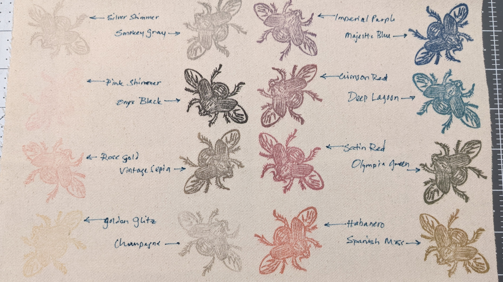

## quick guide

- **ready to ship:** available unique finished items
- **on demand:** available made-on-demand items
- **project gallery:** unavailable finished items

## payment?

Nope! Any items up for grabs operate on an honor system donate-what-you-want model - if you would like to pay for any gifts I send out, I recommend you divert it to a charitable org you care about or to mutual aid. I'll have a list of charity recommendations up eventually, but I always prefer that people give to a charity they care about.

## how to order

Contact me via any of the options linked on this site. Let me know what you're interested in getting (in as much detail as possible please!) and a mailing address.

### can I order multiples?

yes! please do so within reason.

## shipping

I ship via USPS to the United States. International shipping is evaluated on a case-by-case basis - just reach out and ask and I'll see what I can do.

**Ready to ship items** will generally get into the mail within a week or two, depending on when I get to the post office.

**On demand items** have no promised timeline. I do this for fun and am not going to put more deadlines on myself than I already have. Patches or other simple items will be quicker than larger or more complex tasks.

## customization and custom orders

### patches and prints

Here's some representations of the ink colors I have:

- Top row: Habanero, Satin Red, Crimson Red
- 2nd row: Spanish Moss, Vintage Sepia, Imperial Purple
- 3rd row: Olympia Green, Deep Lagoon, Majestic Blue
- 4th row: Smokey Grey, Golden Glitz, Rose Gold
- Bottom row: Silver Shimmer, Champagne, Pink Shimmer

- Leftmost column, top to bottom: Silver Shimmer, Pink Shimmer, Rose Gold, Golden Glitz
- 2nd column: Smokey Gray, Onyx Black, Vintage Sepia, Champagne 
- 3rd column: Imperial Purple, Crimson Red, Satin Red, Habanero
- Rightmost column: Majestic Blue, Deep Lagoon, Olympia Green, Spanish Moss

### knitwear

I am happy to work with you on custom knitting as my schedule/to-do list allows. Reach out and we can talk color/style/etc.
